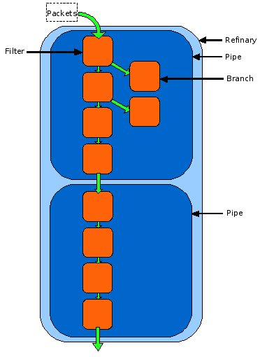

.. _principles:

Principles 
==========
Introduction to the Pypes and Filters Framework
-----------------------------------------------

Pypes and Filters is a framework for working with data. The purpose of Pypes and Filters is to make it easy to manipulate streams of data by “filtering” the data through Filters that in turn form a Pipeline, or Pype.

The top level of a component within the Pypes and Filters framework is called the refinery, a Pype with no parent which all other Pypes descend from. The first level within the refinery contains Pypes, which combine filters along a sequential non-linear path and are also filters themselves. Filters are the basic building blocks from which a component within the Pypes and Filters framework is constructed.

Pypes are non-linear in that they can contain branches which deviate from the main flow of the Pipeline and perform a task, before returning to the point in the main flow from which the branch started. During this time, the Pypes flow is paused until the branch completes its task.

Below is a diagram to help explain these basic concepts of the Filter Pype framework.

Packets
-------
Packets are data structures for passing around data, attributes and even other data structures. While filters control the flow of the data, packets actually contain the data.

The :class:`DataPacket` class has several methods and variables:

:data:`data` - Contains the data payload for the packet

:data:`__dict__` - The packets dict object

:data:`fork_destination` - Can be None, 'main' or 'branch'

:data:`sent_from` - The filter from where the data was sent from

:meth:`clear_data` - Sets the :data:`data` variable for the packet to '' (empty string)

:meth:`clone` - Creates a new packet with the same data and parameters as the one that this method is being called on. The data can be changed during a :meth:`clone` call by using the data keyword

:meth:`_get_data_length` - If the data is a string, this will return its length

Filters
-------

A Filter is a process that should do **one** and only one transformation to the data or perform **one** useful task. This transformation or task can be anything from breaking the data up into smaller chunks or putting smaller chunks back together, to reading data from a file.

Filters are the smallest part of the framework and should be used to build bigger, more complex systems.

How they work
'''''''''''''
Filters, once created and in a Pipeline, will sit and wait for data packets. Once a data packet is fed to a Filter it will do whatever task it has been made to perform and then pass the data forward onto the next Filter. Filters do not have any knowledge of the Pipeline, which Filter came before it or which Filter is next in the Pipeline. Filters do not have to pass on the data packets and some Filters are designed this way. The end Filter in a Pipeline may want to collect the data packets, or another Filter may be designed to discard data packets sent to it.

Filter names
''''''''''''
There are two ways to define and name a Filter in the Pipeline:
1) route definition:

.. code-block:: none
    
   [--route--]
   write_file:outfile.out >>>
   sink_1:5

Filters defined in the route must have a name that begins with the ftype of the Filter ('sink_1' is acceptable as it begins with 'sink').
Any keys that need to be passed must be done in the route using ':' to separate different keys.

.. code-block:: none
    
   [write_output]
   ftype = write_file
   file_name = outfile.outfile
   
   [sink_1]
   num_pkts = 5

   [--route--]
   write_output >>>
   sink_1

Filters defined before the route have a name that can be referred to within the Pipeline eg, [write_output].
The type of Filter is either defined by an 'ftype=...' or is the first part of the Filter name ('sink_1' is acceptable as it begins with 'sink').
Keys can then be set with the syntax 'key_name=value' as shown in the above example.

Examples
''''''''
Here are a few simple filters to help show how they are constructed:

.. code-block:: python

  class Waste(dfb.DataFilter):
      """A waste filter just throws away all the packets it sees. This is used
      when combining results from branches and the main stream is not wanted.
      """ 
      ftype = 'waste'
                  
      def filter_data(self, packet):
          pass

This Filter is the most basic Filter. It inherits from Class DataFilter. It shows the very basic structure of a Filter. Each Filter may or may not have an ftype. An ftype is a name for a Filter, which in this case is waste. The filter_data() method is the method in which the main functionality of the Filter takes place. In the case of this Filter, that is nothing. The Filter will just discard any data given to it.

.. code-block:: python

     class PassThrough(dfb.DataFilter):
      """A pass through filter just forwards all packets to the next filter. 
         There are various uses for a null node, such as being able to redirect 
         pipeline flow while the pipeline is active. Alternatively, it may be 
         used for simulating multiway branching, with a syntax built around 
         binary branching.
      """
      ftype = 'pass_through'
      
      def filter_data(self, packet):
          self.send_on(packet)

This is another simple example, but instead of just discarding the data, it uses the :meth:`send_on` method to send the packet on to the next filter in the pipeline. It doesn't change the data or the packet in any way.

.. code-block:: python
   
    class CountPackets(dfb.DataFilter):
     """Count the number of packets passing a filter. Unlike IDPacket and
     CountLoops, nothing is written to the packet, just to the filter.
     """    
     ftype = 'count_packets'
     keys = ['count_packets_field_name:counted']
 
     def filter_data(self, packet): 
         cpfn = self.count_packets_field_name
         self.__dict__[cpfn] = self.__dict__[cpfn] + 1
         self.send_on(packet)
                 
     def zero_inputs(self):
         self.__dict__[self.count_packets_field_name] = 0

This next example shows a filter that acts as a packet counter. Along with an ftype it also allows for keys to be passed in (a little like arguments to a method or function). There is also an additional method included in this filter that is not seen in the previous filters shown: :meth:`zero_inputs`

:meth:`zero_inputs` is not required to be overridden but is useful for several reasons. During initialisation of a filter, there may be inputs and counters that need to be set to zero. By putting these in the :meth:`zero_inputs` method duplicate code can be avoided where clearing is required repeatedly. Some filters also require various variables and elements to be cleared  or reset before each use. :meth:`zero_inputs` is also called by the :meth:`closing` context manager.

Pypes / Pipelines
-----------------

Pipelines are simply Filters that have been put together to form a pipeline structure. Imagine a refinery where crude oil is being put through a pipeline where it encounters various filters to change it into other things.

Pipeline Configuration
----------------------
In order to create a Pipeline, a configuration for that Pipeline must be made.

A config looks a little like this:

.. code-block:: none

   [--route--]
    sink1 >>>
    sink3 

The route section is the only required section for the configuration. The Filters should be listed in this section and should be in the order that they are to be executed in.

.. code-block:: none

   [--main--]
   ftype = testing
   description = TO-DO: docstring
   
   [batch_which_isnt_a_batch]
   ftype = sink
   
   [--route--]
   batch_which_isnt_a_batch

This is a slightly more complicated example. The [--main--] section is for setting some general keys for the pipeline. The [batch_which_isnt_a_batch] section is for setting keys that relate to a filter. Setting the ftype to 'sink' in this section tells the parser that this is a Filter of type sink. This allows the user to make up their own names for Filters, no matter their actual ftype.

.. code-block:: none

   [--main--]
   ftype = testing
   description = TO-DO: docstring

   [--route--]
   distill_header:100 >>>
       (batch:55)
   sink >>>
   batch:55

In this example a branch can be seen. The branch must follow the filter from which the branch is made and should be indented and surrounded by round brackets. More than one filter may be present in a branch.

Another aspect of the config syntax can also be seen in this example. Looking at the distill_header filter in the [--route--] section it should be noted how the filter name is followed by a colon and the number 100. Filters that take keys can have the value of the key inserted in this fashion. Using distill_header:100 will pass the value of 100 to the first key argument in the filter. If a filter can take more than one key argument then each argument should be separated by a colon. For example;

.. code-block:: none

   filtername:123:78:90

This will provide the filter filter_name with 3 arguments: 123, 78 and 90

Using the configuration
'''''''''''''''''''''''

In order to use the configuration it must be put somewhere. A configuration may be saved as plain text in a file with a .pype extension. It may also be included in a Python source file. To include it in an external .pype file all that
needs to be done is to write the Pipeline and save it in a .pype file in the pypes directory (found in FilterPype/filterpype).

Configurations can be included in Python code by putting them into a variable such as:

.. code-block:: none

   config = '''
        [--main--]
        ftype = demo 
        description = TO-DO: docstring
        keys1 = a1:joe, b2, c3, d4
        keys2 = w:10, x:0xFF, y:12.5, z:false, ghj:asdf, foo:none, baz:none
        
        [--route--]
        pass_through
        '''

This config variable may now be used in the creation of a pipeline object:

.. code-block:: none

   pipeline5 = ppln.Pipeline(factory=factory_object, config=config)

Scope
-----
Now the basics of Filters have been covered it seems sensible to talk about scope. There are 3 general levels of scope:

1) Python environment: this is stored in the Repository and accessible to all Pipelines.

2) Pipeline keys: parameters that can be passed into the Pipeline upon its creation. These pipeline keys are also stored within the repository.

3) Filter variables: parameters that can be passed into the Filter upon its creation.

Python environment
''''''''''''''''''
It is completely possible to use the filterpype language and framework without knowing Python. Those who are not familiar with the Python language may wish to skip this section.

The Python environment has two fundamental uses:
 - It allows Python users to quickly insert a block of Python that mimics Filter, without having to go through the process of writing a separate Filter in the framework etc.
 - It allows global variables to be accessed and modified by any Pipeline in the repository. A Filter can have a key that refers to a Python environment variable and thus changes to this variable will propogate through.

This is an environment where actual Python code can be written. Therefore variables can be created and modified that will be accessible for all Python blocks within the Pipeline. The naming convention for these variables is upper case.

Keys created and changed within the Python environment can be referred to from the Pipeline level if the Pipeline is declared as dynamic. This can be achieved in one of two ways, either in a Pipeline's main section:

.. code-block:: none
   
   [--main--]
   ftype = demo_dynamic_pipeline1 
   description = Pipeline to test dynamic parameter setting
   keys = foo, bar:27
   dynamic = True

Or as an argument passed to the Pipeline's constructor:

.. code-block:: python

   import filterpype.pipeline as ppln
   
   pipeline = ppln.Pipeline(factory=self.factory, config=self.config1,
                            foo='jim', dynamic=True)

In order to use a Python created key, the Pipeline must be declared as dynamic and the key must be referenced by its name (upper case) prefixed with a % character.

Python blocks can also refer to Pipeline level keys.  They can refer to these keys by using ${pipeline_key_name} format.

For example

.. code-block:: none

   [--main--]
   ftype = filewriter
   description = filewriter pipeline
   keys = initial_file_name   
   
   [py_change_filename]
   # count is not initialised the first time we go through this python block
   try:
      COUNT + 0
   except NameError: # initialise the count variable
      COUNT = 0
      FILE_NAME = ${file_name}
   if COUNT > 5: 
      FILE_NAME = "greater_than_6_pkts.out" # change the python env global variable
   COUNT += 1
   
   [write_file]
   # key file_name in write_file filter refers to the python environment variable FILE_NAME
   file_name = %FILE_NAME
   
   [--route--]
   py_change_filename >>>
   write_file

The Pipeline above is made up of two components - the py_change_filename Python code block and the write_file filter.
The write_file Filter's file_name key refers to the Python environment variable FILE_NAME.  FILE_NAME is changed as the Pipeline executes through the py_change_filename Python code block.
py_change_filename inspects the global COUNT variable and waits for it to become greater than 5; at which point it will set FILE_NAME to be equal to "greater_than_6_pkts.out"
This change will carry through to the write_file Filter which will now write to a file with the new name.
Note; the py_change_filename Python block initially sets FILE_NAME to be equal to the Pipeline level key initial_file_name (which is set upon pipeline creation) - it does this using the ${} notation.

Pipeline keys
'''''''''''''
Pipeline keys are the keys passed into the Pipeline upon its creation. Their scope is to the Pipeline in which they have been provided. Pipelines
at a lower level do not have access to these keys unless they are provided with them. However, it should be noted that this is not a reference to the actual key and will be treated as a literal value.

Filter keys
'''''''''''
Filter keys are keys that are passed into the Filter upon its creation. Their scope is within the Filter to which they were provided. Anything outside of the Filter does not have access
to the keys.

Factories
---------

Factories are used for mapping the ftype of a Filter to the actual Filter class that should be executed. Factories are required for Filters that are
written in Python code and not in a .pype file.

